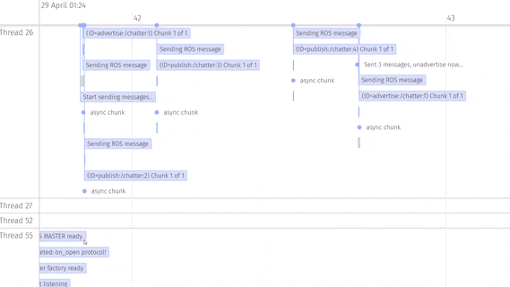

# Timeline logfile viewer

> Multi-timeline logfile tailing

Tiny little logfile viewer/tail in timeline format, especially useful when working with multi-threaded code.

## What is this??

It's `tail -f` but on your browser, and in a timeline format. And if you ask it nicely, it shows multiple threads in separate timelines.

I really coded this for myself, but perhaps it's useful for others, so, this is what it can do so far:

* **Stream logfiles to your browser line-by-line**
* One timeline per thread!
* Pairing BEGIN/END lines in ranges.
* Show as boxes or points.
* Tooltips.

## Settings

### Logfile line format

If your logfile uses the following format: `[thread-id] [time] message`, it will create different timelines per thread.

If not, it will assume all lines are on the main thread and time is arrival to the browser.

For another format, change the `loglineParser` regex on `index.html`.

### Logfile tailing

By default, it will follow the updates of the file.

You can disable it with the following query string parameter: `no-follow=true`

### Pairing BEGIN/END files

If a pair of lines contain the keywords `(BEGIN=id)` and `(END=id)` (where `id` should be a unique identifier), a range will be created from the occurance of the `BEGIN`, until the `END`.

Ranges are shown in green.

### Adding tooltips

If your line contains a `|`, the part after it is moved into a tooltip.

### Box vs Point display

If your line begins with `*`, it will be displayed as a single point instead of a text box.

## Prerequisites

* [Node.JS](https://nodejs.org/)

## Getting Started

* Clone this repository and open a terminal in that directory.
* Install dependencies:

        npm install

* Run it:

        npm start

* Open your browser and go to [localhost:8080?file=YOUR_LOGFILE](http://localhost:8080/?file=YOUR_LOGFILE) replacing `YOUR_LOGFILE` with the local path to the file you want to view.
